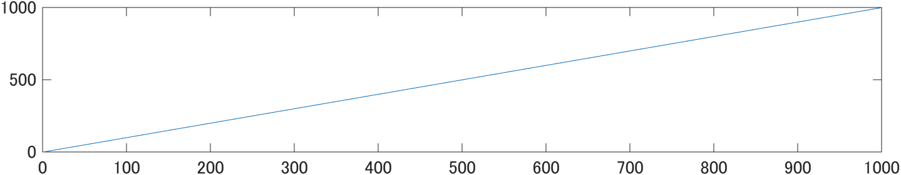
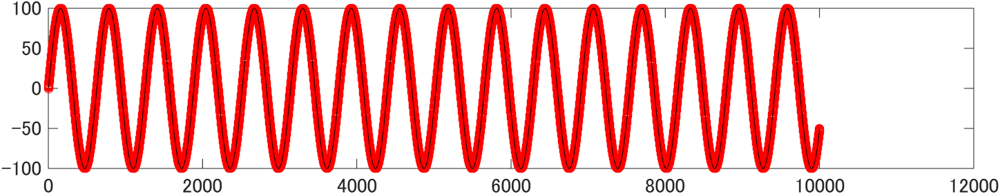
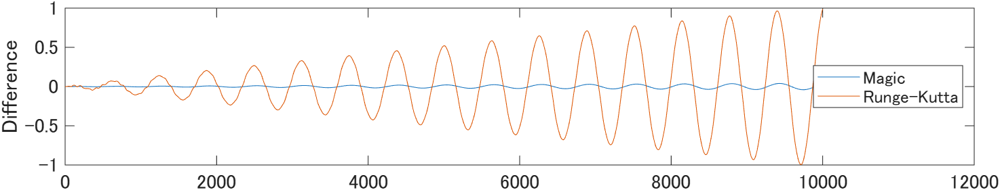
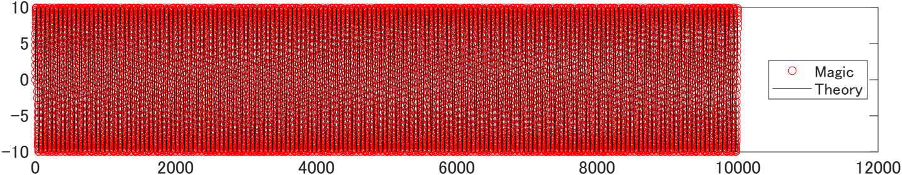
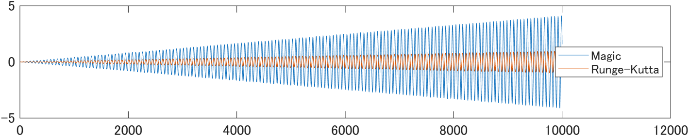
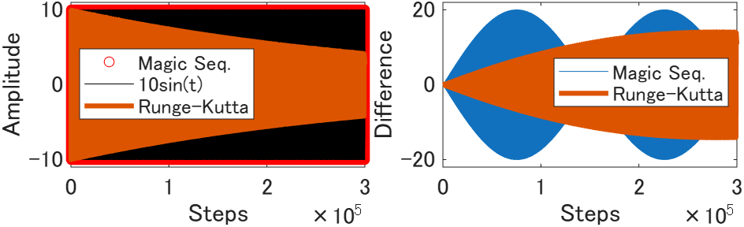
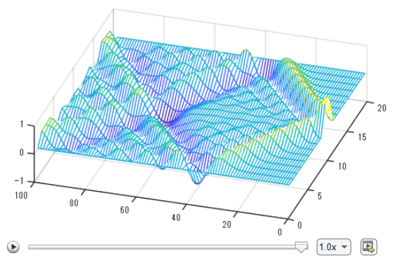
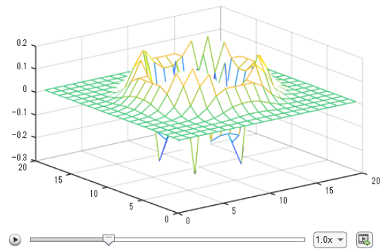
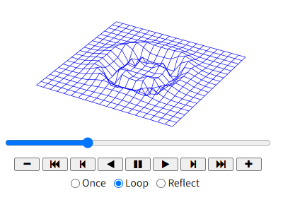

# 3. Basic Explanation: Magic of Sequences (Numerical Experiments of Simple Harmonic and Damped Oscillations)

**Table of Contents**

## 3.1 Revealing the "Magic of Sequences": Overview of the MATLAB Live Script (with Python code)

This document is a Markdown export of the original MATLAB Live Script ([Magic_of_Sequence_MATLAB.mlx](Magic_of_Sequence_MATLAB.mlx)), with minor adjustments, for readers who do not have a MATLAB environment. Please note that while each section in this document perfectly matches the original file, there are two differences: the section numbers here start from "3" (instead of "2" in the original file), and this explanatory paragraph has been added.

### Explanation for first-year university students
This MATLAB program code (Live Script format) is based on the "Magic of Sequences" teaching materials. It has been used in the first April class for first-year students in the Department of Physical Sciences, College of Science and Engineering, Ritsumeikan University, in the introductory course "Micro and Macro Worlds" `[1, 2, 3]`. By slightly changing the coefficients of the local micro rule ($u_n = a \times u_{n-1} - b \times u_{n-2}$; a three-term recurrence relation), the macroscopic result appears as different curves. This aims to help students smoothly transition from high school "Mathematics", "Physics", and "Information I" to university "Mathematics", "Physics", and "Computer and Information Science and Engineering".

It is designed so that students can learn without detailed mathematical explanations of the forward difference method (Euler method) `[4]`, which is frequently used in introductory computer education.

### *Explanation for undergraduate students in specialized courses*
*Since I taught "Micro and Macro Worlds", I recognized that this "Magic of Sequences" relates to many specialized university courses and can be used to introduce them. When creating this open educational content, I asked a generative AI for help. This resulted in materials such as the correlation diagram in [README_en.md](README_en.md) `[5]`, [explanations using knowledge from specialized courses](4_Magic_of_Sequence_Advanced_en.md) `[6]`, and [examples of how numerical array operations like the "Magic of Sequences" are used in the real world](5_Magic_of_Sequence_Edu_Significance_en.md) `[7]`, [Historical background of the "Magic of Sequences" learned by the author from generative AI](6_Historical_Context_via_AI_en.md) `[8]`.*

*The comparison with the fourth-order Runge-Kutta method `[4]` was not included in the original material for first-year students. I decided to include it now because a generative AI suggested it would be interesting in July 2026. The fourth-order Runge-Kutta method is a high-precision version of the Euler method (first-order Runge-Kutta method), often used in introductory computer education. It is considered a standard high-precision tool for ordinary differential equations in various fields. However, I did not include it for first-year students because it is too difficult to teach in their first month. But the generative AI pointed out that the "Magic of Sequences" has properties that avoid the problems faced by the Runge-Kutta method `[8]`, as shown in Figure 6 in Section 3.5 of this MD file (corresponding to Section 2.5 in MATLAB Live Script). Because the computer code for the "Magic of Sequences" is very simple, undergraduate students in specialized courses can use it effectively. It helps when studying the difficulties `[8]` experienced by forward difference and non-energy-conserving methods in fields like molecular dynamics, astronomy, and AI (deep learning), and how those difficulties were avoided. These research fields are different from my own specialty, so I rarely had the chance to overview such recent research. I enjoyed the generative AI's overview capability.*

### Required Environment to Enjoy MATLAB Live Script
To use this MATLAB Live Script, you need MATLAB 2022a or a newer version `[9]`. You also need the MATLAB Live Editor environment `[9]`. While this environment has advanced features, it does not run on mobile browsers on smartphones or tablets. Therefore, this document also provides [an interactive HTML app](https://ritshiroshio.github.io/Magic_of_Sequences/index_en.html) `[10]` that runs in a browser and an approach using Google Colab (Python) that can run on a mobile browser. This allows students to easily run and observe the simulations on their mobile devices.

As of July 2026, chat-based generative AI is widely available and very useful. By simply providing the "Content of Section 3.2" below, the AI generated the HTML app mentioned above. The translation from MATLAB code to Python code was also instant.

## 3.2 MATLAB and Python Codes for the 5 Basic Patterns of the "Magic of Sequences"

### 3.2.1 When $a=2, b=1$
The following single line is the MATLAB code for the parameters $a=2, b=1$. When you run it, a straight line going upward to the right (motion with zero acceleration) is drawn on the screen. Here, initial values are u(1)=0, u(2)=1.

```matlab
clear; a=2; b=1; u(1)=0; u(2)=1; for n=3:1000; u(n)=u(n-1)*a - u(n-2)*b; end; plot(u)

```



*Figure 1: Magic of Sequences, (a,b)=(2,1)*

The following Python code corresponds to the MATLAB code above.

```python
import matplotlib.pyplot as plt
import numpy as np

a = 2
b = 1
n_max = 1000

u = np.zeros(n_max)
u[0] = 0
u[1] = 1

for n in range(2, n_max):
    u[n] = u[n - 1] * a - u[n - 2] * b

plt.plot(u)
plt.show()

```

u(1)=0 in MATLAB corresponds to u[0]=0 in Python. Also, `for n=3:1000; ...; end` in MATLAB corresponds to `for n in range(2, n_max):` in Python. Please note the difference in index numbers. The indented line in the Python code above means the process repeats for n from 3 to 999. When copying and pasting, be careful to keep the indentation correct.

### 3.2.2 When parameters $a$ and $b$ are different values

Please change the coefficients to $(a,b) = (1.9999, 1)$, $(1.99, 1)$, $(1.99, 0.99)$, or $(1.98, 0.99)$, and run the code. The output will change into various numerical approximate solutions corresponding to physical dynamical systems or electronic circuit responses taught in university, such as sine waves (long-period or short-period simple harmonic oscillations), curves asymptotically approaching a constant value exponentially, or damped oscillations. If you use other combinations, you will notice that the curve characteristics change at certain boundary values. This is easier to observe using [the interactive HTML app](https://ritshiroshio.github.io/Magic_of_Sequences/index_en.html) `[10]` introduced above.

### 3.2.3 When the initial value is 1

If you change the initial value from 0 to 1 and run the code, the sine function changes into a cosine function.

## 3.3 The true nature of the "Magic of Sequences": Finite Difference Method for Differential Equations

The reason a simple recurrence relation draws a sine wave is that it calculates the numerical approximate solution of the equation of motion (differential equation) in physics, which is taught at the university level.

Consider a harmonic oscillator system where a mass of $m=1\text{ kg}$ is connected to a spring with a spring constant $k=1\text{ N/m}$. Let $u$ be the position of the mass. The equation of motion (differential equation) is $\frac{d^2u}{dt^2} + u = 0$. The theoretically exact solutions obtained mathematically are sine waves ($\sin(t)$ or $\cos(t)$). A differential equation is a local rule that describes how the "current" state relates to the "previous and next" states. We discretize this so a computer can process it.

#### Discretization by the Central Difference Method (St�«Órmer-Verlet Method `[8]`)

When a continuous curve is approximated by a polygonal line, let $\Delta t$ be the finite time interval. Let the positions at three consecutive points be $u_{n-1}, u_n, u_{n+1}$. The acceleration $\frac{d^2u}{dt^2}$ at time $n$ can be approximated using the central difference method (St�«Órmer-Verlet method) as follows:

$$\frac{d^2u}{dt^2} \approx \frac{(u_{n+1} - u_n)/\Delta t -(u_n-u_{n-1})/\Delta t}  {\Delta t} = \frac{u_{n+1} - 2u_n + u_{n-1}}{\Delta t^2}$$

Substituting this into the equation of motion $\frac{d^2u}{dt^2} + u = 0$ gives the following finite difference equation:

$$u_{n+1} = (2 - \Delta t^2)u_n - u_{n-1}$$

If we set the time step to $\Delta t = 0.01\text{ s}$, the equation becomes $u_{n+1} = 1.9999u_n - u_{n-1}$. This matches the coefficients in the experiment code.

Giving the initial conditions $u_1=0, u_2=1$ approximately corresponds to an initial displacement of 0 m and an initial velocity of 1/0.01 = 100 m/s. The corresponding theoretical exact solution is $100\sin(t)$, and $100\sin(0.01) = 0.999983333$. The "Magic of Sequences" gives this numerical approximate solution.

#### When the initial value is 1

Giving the initial condition $u_1=1$ corresponds to an initial displacement of 1 m and an initial velocity of 0, which generates a cosine curve.

A mechanical system with viscous damping (resistance proportional to velocity) corresponds to decreasing the coefficients $a$ and $b$ by the same amount. By using similar discretization, you can describe numerical approximate solutions simply by adjusting the coefficients of adjacent terms in the finite difference equation.

The relationship between the coefficients $a$ and $b$ and the curves is summarized in the following table.

| *a* | *b* | Curve Characteristics |
| --- | --- | --- |
| 2 | 1 | Acceleration 0 (Uniform linear motion) |
| 1.9999 | 1 | Only spring restoring force (Long-period simple harmonic oscillation / Undamped impulse response) |
| 1.99 | 1 | Stronger spring restoring force (Shorter-period simple harmonic oscillation) |
| 1.99 | 0.99 | With velocity-proportional resistance (Exponentially approaches 100) |
| 1.98 | 0.99 | Spring and velocity-proportional resistance (Damped oscillation) |

## 3.4 Comparison with Theoretical Exact Solution (Sine Wave) and Error Evaluation (MATLAB)

### 3.4.1 When $(a,b)=(1.9999,1)$, $\Delta t=0.01$, and steps=10000

Running the following code shows the results of the "Magic of Sequences" (numerical approximate solution by the central difference method; sequence $u$) up to 10,000 steps with red circles, overlapping the theoretical exact solution ($100\sin(t)$) shown with a solid black line.

```matlab
clear; close all
steps=10000;
a=1.9999; b=1;
u(1)=0; u(2)=1; for n=3:steps+1; u(n)=u(n-1)*a-u(n-2)*b; end
y=100*sin(0:0.01:steps*0.01);
plot(u, 'ro'); hold on; plot(y, 'k'); hold off

```



*Figure 2: Comparison between the theoretical exact solution and the numerical approximate solution.*

```matlab
figure
% Runge-Kutta method (ode45) (Option for undergraduate students in specialized courses)
% Convert y'' = -y into a system of first-order equations y1'=y2, y2'=-y1 and solve
[~, Y] = ode45(@(t,y) [y(2); -y(1)], 0:0.01:steps*0.01, [0; 100]);
y2 = Y(:,1)'; % Extract the position solution and transpose to a row vector to match u
plot(u-y); hold on; plot(y2-y)

```



*Figure 3: Difference between the two solutions (Short-term).*

In this figure, the blue line is the difference between the "Magic of Sequences" (numerical approximate solution u) in the upper figure and the theoretical exact solution y. The blue line is small, considering the amplitude of the sine curve is 100. However, as the number of calculation steps increases, the difference becomes larger. Will this difference continue to increase?

#### *Supplementary Explanation of the Fourth-Order Runge-Kutta Method [**For undergraduate students in specialized courses**]*

*Undergraduate students in specialized courses should also pay attention to the orange line (fourth-order Runge-Kutta method; the difference between the forward difference method and the theoretical exact solution). Under the conditions in Section 3.4.1, you can confirm that the Magic of Sequences has higher accuracy.*
> **Note**: The MATLAB code and figure above use the default tolerance of the MATLAB function "ode45". If you set a stricter tolerance, you can achieve much higher accuracy, making the orange line completely flat.

*In introductory physics courses in high school or university, the Euler method (first-order Runge-Kutta method), which is a forward difference method, is often taught. The fourth-order Runge-Kutta method is known to have better accuracy than the Euler method and is always taught in the second year or later in university science and engineering departments. It is typically taught in the second semester of the second year. However, the Euler method requires more explanation than the "Magic of Sequences," and the fourth-order Runge-Kutta method requires even more. Therefore, I did not cover either method in my April class for first-year students. I added the comparison with the Runge-Kutta method because I assume that people with knowledge equivalent to second-year university students or above will read this when it is published on GitHub.*

### 3.4.2 When $(a,b)=(1.99,1)$, $\Delta t=0.1$, and steps=10000

Next, to observe the error when there are more oscillations with the same number of calculations as in Section 3.4.1, we set a larger time step $\Delta t=0.1$ and set $(a,b)=(1.99, 1)$. Then, the solid black line (theoretical exact solution $10\sin(t)$) is drawn so densely that it almost looks filled in solid black.

```matlab
clear; close all
steps=10000;
u(1)=0; u(2)=1; for n=3:steps+1; u(n)=u(n-1)*1.99-u(n-2); end
y=10*sin(0:0.1:steps*0.1);

% Fourth-order Runge-Kutta method (ode45) (Option for undergraduate students in specialized courses)
% Convert y'' = -y into a system of first-order equations y1'=y2, y2'=-y1 and solve
[~, Y] = ode45(@(t,y) [y(2); -y(1)], 0:0.1:steps*0.1, [0; 10]);
y2 = Y(:,1)'; % Extract the position solution and transpose to a row vector to match u

plot(u, 'ro'); hold on; plot(y, 'k');
```



*Figure 4: Behavior during long-term calculation (time step $\Delta t=0.1$).*

* **MATLAB**

```matlab
figure;
plot(u-y);
hold on; plot(y2-y)

```




*Figure 5: Difference between the two solutions (Long-term).*

At this time, the difference (blue line) between the theoretical exact solution (black line) and the "Magic of Sequences (red circles)" continues to increase, approaching the amplitude of 10 for the sine curve. Will the difference between the two increase even further?

#### *Supplementary Explanation of the Fourth-Order Runge-Kutta Method [**For undergraduate students in specialized courses**]*

*When comparing with the fourth-order Runge-Kutta method under the conditions in Section 3.4.2, the fourth-order Runge-Kutta method (orange line) appears to have higher accuracy. However, the difference from the theoretical exact solution continues to increase for both. Will the difference between the numerical approximate solution and the theoretical exact solution increase even further?*

### 3.4.3 Python Code with the Same Algorithm as Section 3.4.2

```python
import numpy as np
import matplotlib.pyplot as plt
from scipy.integrate import solve_ivp

steps = 10000
u = np.zeros(steps + 1)
u[0] = 0
u[1] = 1
for n in range(2, steps + 1):
    u[n] = u[n-1] * 1.99 - u[n-2]

t = np.arange(0, steps * 0.1 + 0.05, 0.1)
y = 10 * np.sin(t)
y2 = solve_ivp(lambda _, Y: [Y[1], -Y[0]], [0, t[-1]], [0, 10], t_eval=t).y[0]

plt.figure(1)
plt.plot(u, 'ro', label='u (Numerical Approximate Solution)')
plt.plot(y, 'k-', label='y (Theoretical Exact Solution)')
plt.legend()

plt.figure(2)
plt.plot(u - y, 'b-')
plt.plot(t, y2 - y, 'r-', label='Theoretical - Runge-Kutta')
plt.show()

```

#### *Supplementary Explanation of the Fourth-Order Runge-Kutta Method [**For undergraduate students in specialized courses**]*

*The Python code above includes the fourth-order Runge-Kutta method, just like the MATLAB code. This is calculated using the same tolerance level as the MATLAB code above.*

## 3.5 Accumulation of Phase Errors and the Beating Phenomenon

I will omit the MATLAB and Python codes, but if you change the number of calculation steps (steps) to 300,000 in the code above and run it, you will see a macroscopic "beating" phenomenon. This is because small phase errors (slight shifts in period or frequency) caused by discretization accumulate over time. It is important to note that the maximum amplitude of the beating, which is 20, is twice the amplitude of the theoretical exact solution $10\sin(t)$. This shows that while the period (frequency) of the numerical approximate solution of the "Magic of Sequences" (central difference) differs slightly from the theoretical exact solution, its amplitude does not decrease even when the number of calculation steps increases.

Computer languages like MATLAB and Python make it easy to code loops that iterate many times, which is difficult in spreadsheet software (like Excel). Therefore, you can experience the limits inherent in numerical approximate solutions (limits of discrete models).



*Figure 6: Macroscopic "beating" phenomenon emerging from the accumulation of tiny phase errors over time.*

*[**For undergraduate students in specialized courses**] The curriculum differs depending on the department or university, but you will understand why this happens and how much they differ when you study the characteristic equations for solving differential equations and Euler's formula for complex functions. This is usually taught from basic mathematics (calculus, linear algebra) in the first year to specialized subjects (ordinary differential equations, complex analysis, etc.) in the second year. For details, please refer to [the explanation using knowledge from specialized courses](4_Magic_of_Sequence_Advanced_en.md) `[6]` in this repository. For example, this dramatic change in the sequence's behavior due to changing coefficients visualizes the concept of "Poles and Zeros" in characteristic equations. Please also refer to [how numerical array operations like the "Magic of Sequences" are used in the real world](5_Magic_of_Sequence_Edu_Significance_en.md) `[7]`, and use it as an introduction to your university lectures.*

> **Note:** As in Section 3.4, the figure above intentionally shows the result using the default tolerance of the MATLAB function "ode45" to emphasize the characteristics of forward difference methods. With a stricter tolerance, the orange line would become a completely flat horizontal line due to higher accuracy.

## 3.6 Extension to Spatial Differences (Wave Equation)

### 3.6.1 One-Dimensional Wave Propagation

The concept of a second-order difference on the time axis (subtracting twice the center value from the sum of two adjacent terms) can be smoothly extended to multiple dimensions on the spatial axis (second-order partial derivative term: Laplacian). By incorporating the spatial second-order difference on the right side, you can easily simulate a 1D wave propagation animation in MATLAB. This allows you to visually observe behaviors in continuum mechanics and wave theory.

Calculation code for simple harmonic oscillation
"Next + Previous - 2 * Current = - (Small Value) * Current"

If you rewrite the right side as
"Next + Previous - 2 * Current = Left Neighbor + Right Neighbor - 2 * Center"

You are changing the equation of motion (differential equation) from $\frac{d^2U}{dt^2} = -U$ to $\frac{d^2U}{dt^2} = \frac{d^2U}{dx^2}$. By fixing the displacement of the mass points at the ends to 0, you can perform a numerical experiment on fixed-end reflection. In programming, you just need to set the initial displacement of the end mass points to 0 and exclude them from the time evolution calculations.

#### MATLAB Code Example

```matlab
figure
U=zeros(100,20); % Allocate space to calculate 100 time steps for 20 mass points
U(1,10:11)=1; U(2,10:11)=1; % Set the displacement of mass points 10 and 11 to 1 for the first and next time steps
% In Python Colab, this is written as "U[0, 9:11] = 1" and "U[1, 9:11] = 1". 
% This is a major difference in Python. The same applies to the array range specification below.

for n=3:100 % Corresponds to "for n in range(2, 100):" in Python. 

    % The next line calculates (Point 1+3, Point 2+4, ..., Point 18+20) at once
    f=U(n-1, 1:18)+U(n-1,3:20); % Sum of left and right adjacent terms
    % The next line subtracts twice the center from the sum of neighbors (a prototype of the Laplacian)
    f=f-2*U(n-1, 2:19); 
    % Mass points 1 and 20 are fixed at 0 and not calculated.
    U(n, 2:19)=2*U(n-1, 2:19)-U(n-2, 2:19)+0.1*f; % Discretization of the wave equation
    mesh(U); view([-72.52 65.38]); drawnow 

end % for n=3:100 % Python does not require "end", but MATLAB does.

```



*Figure 7: A still image of a scene from the 1D wave propagation animation.*

Looking from the front of the screen to the right, the displacement of mass points 1 to 20 is shown by the height, and the left side of the image shows the progress of time. If you use MATLAB 2022a or a newer version, you can run this Live Script and observe the status at different times using the slide bar. By slightly changing the viewing angle, you can export the animation as a video (MP4 or AVI). The 4-second YouTube video at https://youtu.be/08CE5n18Tqk was created this way.

#### Note on the MATLAB animation tools

As of July 2026, there is a known issue: if you use the slider for the 1D animation after both the 1D and 2D animations have finished running, the 2D wave appears in the upper figure window instead of the 1D wave propagation. Since adding code to fix this issue would make the program too complex, we have intentionally omitted it here.
If you want to use the slider to observe the 1D wave propagation, please comment out (or delete) the 2D animation code below before running the script.

#### Python Code Example

The animation feature using `drawnow` in MATLAB is very intuitive. In Python, you can implement animations (flip-book style drawing) with the same simplicity as MATLAB without making the code overly large by using the "Google Colab (Jupyter Notebook)" environment.

The following is the Python code generated by Google Gemini in July 2026 from the MATLAB code above. The Python code looks longer, but the core part that calculates the time evolution of the wave is as compact as MATLAB. The Python code below is for users to run on Google Colab from a smartphone or PC browser to observe wave propagation and reflection, like a waving string.

```python
import numpy as np
import matplotlib.pyplot as plt
from IPython.display import display, clear_output
import time

time_steps = 100
points = 20
U = np.zeros((time_steps, points))

U[0:2, 9:11] = 1

for n in range(2, time_steps):
    f = U[n-1, 0:18] + U[n-1, 2:20]
    f = f - 2 * U[n-1, 1:19]
    U[n, 1:19] = 2 * U[n-1, 1:19] - U[n-2, 1:19] + 0.1 * f
    
    plt.plot(U[n, :], color='blue')
    plt.ylim(-2, 2)
    plt.title(f"Time Step: {n}")
    
    clear_output(wait=True)
    display(plt.gcf())
    plt.clf()
    time.sleep(0.05)

# Uncomment the following line to display on screen
# plt.show()

```

### 3.6.2 Two-Dimensional Wave Propagation

In the code above, we treated the average of two adjacent points in 1D as the Laplacian. If we change this to the average of four adjacent points in 2D, give an initial value only at the center, and repeat the recurrence relation calculation, we can observe 2D wave propagation. To simulate fixed-end reflection, treat the mass points at the edges the same way as in the 1D case. By running the following MATLAB code and slightly changing the viewing angle, you can easily create the video shown at https://youtu.be/NThFZbwJDh0.

#### MATLAB Code Example

```matlab
% Example MATLAB script to observe 2D wave propagation.
% You can easily create animation videos using MATLAB Live Editor.
figure
U_n = zeros(20,20); U_n_1=U_n; % Set the save areas for current and next states to 0.
U_n_1(10:11,10:11) = ones(2,2); U_n_2 = U_n_1; % Initial displacement of 1 for the center 4 points only.
for n=1:120 
    sum4 = U_n_1(1:18,2:19) + U_n_1(3:20,2:19); % Sum of adjacent points in one horizontal direction
    sum4 = sum4 + U_n_1(2:19,1:18) + U_n_1(2:19,3:20); % Sum of adjacent points in the orthogonal direction
    laplacian = U_n_1(2:19,2:19) - sum4/4; % Laplacian-like term
    % 2 * Current - Previous - Laplacian * Propagation Speed * Time Step
    U_n(2:19,2:19) = 2*U_n_1(2:19,2:19) - U_n_2(2:19,2:19) - 0.1*laplacian;
    mesh(U_n);zlim([-1 1]);view([-40.867 56.536]);drawnow 
    U_n_2 = U_n_1; U_n_1 = U_n; % Move data save locations (Current -> Previous; Next -> Current)
end % iterate from "for n=1:100" to this "end"

```



*Figure 8: A still image of a scene from the MATLAB 2D wave propagation animation.*



*Figure 9: A still image of a scene from the Python 2D wave propagation animation.*


#### Python Code Example

Below is an example of the Python code generated by a generative AI in July 2026 from the MATLAB code. I instructed the generative AI to create a smooth animation, so it is longer than the previous Python code, but the AI could generate code to this extent.

The following is an example of the Python code. If you run it on Google Colab, it will allow detailed observation.

```python
import numpy as np
import matplotlib.pyplot as plt
import matplotlib.animation as animation
from IPython.display import HTML

time_steps = 120
points = 20
U_n = np.zeros((points, points))
U_n_1 = np.zeros((points, points))
U_n_1[9:11, 9:11] = 1.0
U_n_2 = np.copy(U_n_1)

X, Y = np.meshgrid(np.arange(points), np.arange(points))

U_history = []

for n in range(time_steps):
    sum4 = U_n_1[0:18, 1:19] + U_n_1[2:20, 1:19]
    sum4 = sum4 + U_n_1[1:19, 0:18] + U_n_1[1:19, 2:20]
    laplacian = U_n_1[1:19, 1:19] - sum4 / 4.0
    
    U_n[1:19, 1:19] = 2 * U_n_1[1:19, 1:19] - U_n_2[1:19, 1:19] - 0.1 * laplacian
    
    U_history.append(np.copy(U_n))
    
    U_n_2 = np.copy(U_n_1)
    U_n_1 = np.copy(U_n)

fig = plt.figure(figsize=(6, 5))
ax = fig.add_subplot(111, projection='3d')

def update(frame):
    ax.cla() 
    ax.set_zlim(-1.5, 1.5) 
    ax.set_axis_off()      
    ax.plot_wireframe(X, Y, U_history[frame], color='blue', linewidth=0.5)

anim = animation.FuncAnimation(fig, update, frames=time_steps, interval=50)

plt.close(fig)

HTML(anim.to_jshtml())

# --- Note: If you want to save it as a GIF file, add the following to the end of the Python code and run it ---
# anim.save('wave_2d.gif', writer='pillow', fps=20)
# print("GIF file saved.")

```

## 3.7 License

The program code and document materials are provided under the [Creative Commons Attribution 4.0 International (CC BY 4.0)](https://creativecommons.org/licenses/by/4.0/) license.

## 3.8 Citation

When citing the programs and explanatory data in this GitHub repository, please refer to the following permanent DOI issued by Zenodo. [DOI insertion position (Insert the temporary DOI issued by Zenodo)]

## References and Notes

`[1]`: Syllabus of Ritsumeikan University, Department of Physical Sciences, "Micro and Macro Worlds" (2016)  https://syllabus.ritsumei.ac.jp/syllabus/s/r-syllabus/a0ifD000003F2pUQAS/201631211?language=ja (Accessed July 2026) * During the era of using Microsoft Excel.

`[2]`: Ibid. (2018) https://syllabus.ritsumei.ac.jp/syllabus/s/r-syllabus/a0ifD000003Ee1qQAC/201831549?language=ja (Accessed July 2026) * Syllabus for the first year MATLAB became available. A computer lab was still required.

`[3]`: Ibid. (2023) https://syllabus.ritsumei.ac.jp/syllabus/s/r-syllabus/a0ifD000003EblHQAS/202331861?language=ja (Accessed July 2026) * After the COVID-19 pandemic, all students had their own PCs, so a computer lab was no longer necessary.
`[4]`: Examples of prior research and public teaching materials: [F.Goldberg, S.Bendall, Am. J. Phys. 63 (1995) 978](https://doi.org/10.1119/1.18085). / [Akihiro OGURA, Journal of the Physics Education Society of Japan 61 (2013) 21](https://doi.org/10.20653/pesj.61.1_21). / [Ministry of Education, Culture, Sports, Science and Technology, Japan "Teaching Materials for High School Informatics Teachers 'Informatics I' (Chapter 3: Specialized Problem Solving and Programming)" (2019) pp. 118-123](https://www.mext.go.jp/content/20200722-mxt_jogai02-100013300_005.pdf).

`[5]`: [In this repository: README_en.md](README_en.md)

`[6]`: [In this repository: Revealing the "Magic of Sequences" for 2nd and 3rd-year undergraduate students](4_Magic_of_Sequence_Advanced_en.md)

`[7]`: [In this repository: What the "Magic of Sequences" anticipates in university studies](5_Magic_of_Sequence_Edu_Significance_en.md)

`[8]`: [In this repository: Historical background of the "Magic of Sequences" learned by the author from generative AI](6_Historical_Context_via_AI_en.md)

`[9]`: The basic features of the latest MATLAB version are available via MATLAB Online, which can be used on a PC web browser. You can search for "MATLAB Online" and start using it. Even without a paid license, you can use it for free up to 20 hours per month. Creating a MathWorks account is required, but you can also use free courses and other educational resources.

`[10]`: [In this repository: An HTML app to enjoy the "Magic of Sequences" on mobile browsers](https://ritshiroshio.github.io/Magic_of_Sequences/index_en.html)

## Repository Structure and Contents

* **[README_en.md](README_en.md)**
* **[index_en.html](https://ritshiroshio.github.io/Magic_of_Sequences/index_en.html)**
* **[Magic_of_Sequence_MATLAB_en.mlx](Magic_of_Sequence_MATLAB_en.mlx)**
* **[3_Magic_of_Sequence_Plain_en.md](3_Magic_of_Sequence_Plain_en.md)**
* **[4_Magic_of_Sequence_Advanced_en.md](4_Magic_of_Sequence_Advanced_en.md)**
* **[5 How does this magic connect to university topics?](5_Magic_of_Sequence_Edu_Significance_en.md)**
* **[6 Historical Context Learned from Generative AI](6_Historical_Context_via_AI_en.md)**